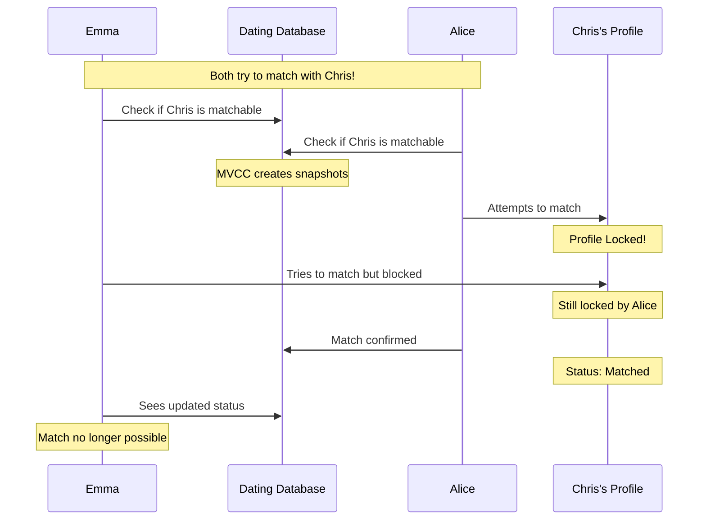

# Backend Development Guide

## Navigation

- [Database Concurrency](#database-concurrency)
- [Node.js Architecture](#nodejs-architecture)

---

# Database Concurrency

## Dating App Concurrency Control Example

This example demonstrates how PostgreSQL handles concurrency in a dating app scenario where multiple users (Emma and Alice) attempt to match with the same profile (Chris).

## Table of Contents

- [Process Overview](#process-overview)
- [Sequence Diagram](#sequence-diagram)
- [Concurrency Control Methods](#concurrency-control-methods)
  - [MVCC](#mvcc)
  - [Transaction Isolation Levels](#transaction-isolation-levels)
  - [Explicit Locking](#explicit-locking)
  - [Advisory Locks](#advisory-locks)

## Process Overview

When multiple users attempt to match with the same profile simultaneously, PostgreSQL's concurrency control ensures data consistency and prevents race conditions using various mechanisms.

## Sequence Diagram



## Concurrency Control Methods

### MVCC

Multi-Version Concurrency Control allows multiple users to view the profile simultaneously without blocking:

```sql
-- Original status
SELECT status FROM dating_profiles WHERE name = 'Chris';
-- Returns: 'matchable'

-- Alice starts matching process
BEGIN;
UPDATE dating_profiles
SET status = 'matched',
    matched_with = 'Alice'
WHERE name = 'Chris';
COMMIT;

-- Emma still sees 'matchable' until her transaction ends
-- This prevents confusion during the matching process
```

### Transaction Isolation Levels

#### READ COMMITTED (Default)

```sql
BEGIN;
SELECT status FROM dating_profiles
WHERE name = 'Chris';
-- sees: 'matchable'

-- After Alice's match completes:
SELECT status FROM dating_profiles
WHERE name = 'Chris';
-- sees: 'matched'
```

#### REPEATABLE READ

```sql
BEGIN;
SET TRANSACTION ISOLATION LEVEL REPEATABLE READ;
SELECT status FROM dating_profiles
WHERE name = 'Chris';
-- sees: 'matchable'

-- Even after Alice matches:
SELECT status FROM dating_profiles
WHERE name = 'Chris';
-- still sees: 'matchable'
```

### Explicit Locking

Ensures only one person can complete the matching process at a time:

```sql
BEGIN;
-- Lock the profile during matching
SELECT * FROM dating_profiles
WHERE name = 'Chris'
AND status = 'matchable'
FOR UPDATE;  -- Locks the profile

UPDATE dating_profiles
SET status = 'matched',
    matched_with = 'Alice'
WHERE name = 'Chris';
COMMIT;
```

### Advisory Locks

Application-level locks for custom matching logic:

```sql
-- Lock during matching process
SELECT pg_advisory_lock('match_chris');
-- Process matching logic
SELECT pg_advisory_unlock('match_chris');
```

## Key Benefits

- Prevents double matches
- Maintains data consistency
- Provides real-time status updates
- Ensures fair matching process

## Best Practices

1. Always use transactions for matching operations
2. Implement proper error handling for lock timeouts
3. Keep transactions as short as possible
4. Use appropriate isolation levels based on requirements

---

# Node.js Architecture

## The Bartender Analogy: Understanding Node.js

Meet Joe, the most efficient bartender in town. He represents Node.js, created by Ryan Dahl in 2009 because he was frustrated with how Apache handled many concurrent connections (imagine lots of slow bartenders trying to serve everyone).

### Quick Example

```javascript
// The Bar System (Node.js Architecture)
console.log("🍺 Bar is open!");

setTimeout(() => {
    console.log("🥃 Your cocktail is ready!");
}, 2000);

console.log("📝 Taking more orders...");
```

### The Bar Setup (Node.js Architecture)

#### 1. The Call Stack (Joe's Brain)

```javascript
function makeOldFashioned() {
    addWhiskey();
    addBitters();
    addSugar();
    stir();
}
// Each step gets added to stack and removed when done
```

- Like Joe's immediate attention
- Can only do ONE thing at a time
- Works LIFO (Last In, First Out)
- If Joe starts making a drink, he finishes it before starting another

#### 2. Event Loop (Joe's Eyes & Instincts)

```javascript
while (barIsOpen) {
    checkForNewOrders();
    checkIfDrinksAreReady();
    serveReadyDrinks();
    checkIfAnyoneNeedsAttention();
}
```

- Constantly checking:
  - New orders (New requests)
  - Ready drinks (Completed callbacks)
  - Customers needing attention (Pending events)

#### 3. Callback Queue (The Bar Counter)

```javascript
OrderQueue = [
    "Serve Martini to Table 1",
    "Check on Table 2's water",
    "Give bill to Table 3"
]
```

- Where completed tasks wait to be handled
- First come, first served (FIFO)

#### 4. Background Workers (Bar Staff)

```javascript
// These are like libuv thread pool
apprenticeMixer.prepareGarnish();
iceManager.refillIce();
glassWasher.cleanGlasses();
```

- Handle time-consuming tasks
- Work in parallel while Joe keeps serving

### Real-World Example

```javascript
const bar = require('bar-service');

console.log("👋 Customer walks in");  // 1. Immediate task (Call Stack)

// 2. Long running task (Sent to background)
bar.makeComplexCocktail(() => {
    console.log("🍸 Cocktail ready!");  // 4. Callback executed
});

console.log("🤝 Welcome next customer");  // 3. Continue serving others
```

### Why It's Awesome

#### 1. Single-Threaded But Not Blocking

- Joe (main thread) never stops moving
- Can handle hundreds of orders without getting overwhelmed

#### 2. Event-Driven

- Like Joe reacting to:
  - New customers walking in (new connections)
  - Drinks being ready (completed I/O)
  - Bills to be processed (completed tasks)

#### 3. Non-Blocking I/O

```javascript
// Instead of:
waitForDrinkToBeReady(); // ❌ Blocking

// Node.js does:
startMakingDrink(() => {
    serveDrink();  // ✅ Non-blocking
});
serveOtherCustomers();
```

### Perfect Use Cases

- Chat applications (lots of quick customer interactions)
- Real-time games (constant order updates)
- Streaming (continuous drink service)

### Not Ideal For

- Complex calculations (like calculating everyone's tab at once)
- CPU-intensive tasks (like simultaneously mixing 100 complicated cocktails)

---
