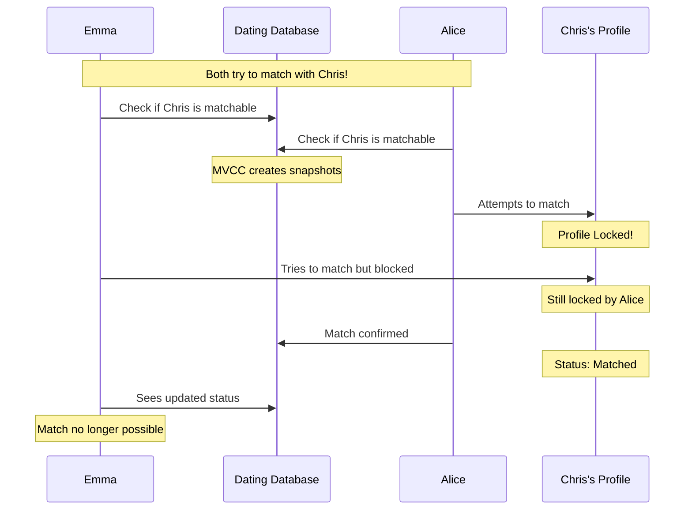

# Dating App Concurrency Control Example

This example demonstrates how PostgreSQL handles concurrency in a dating app scenario where multiple users (Emma and Alice) attempt to match with the same profile (Chris).

## Table of Contents

- [Process Overview](#process-overview)
- [Sequence Diagram](#sequence-diagram)
- [Concurrency Control Methods](#concurrency-control-methods)
  - [MVCC](#mvcc)
  - [Transaction Isolation Levels](#transaction-isolation-levels)
  - [Explicit Locking](#explicit-locking)
  - [Advisory Locks](#advisory-locks)

## Process Overview

When multiple users attempt to match with the same profile simultaneously, PostgreSQL's concurrency control ensures data consistency and prevents race conditions using various mechanisms.

## Sequence Diagram



## Concurrency Control Methods

### MVCC

Multi-Version Concurrency Control allows multiple users to view the profile simultaneously without blocking:

```sql
-- Original status
SELECT status FROM dating_profiles WHERE name = 'Chris';
-- Returns: 'matchable'

-- Alice starts matching process
BEGIN;
UPDATE dating_profiles
SET status = 'matched',
    matched_with = 'Alice'
WHERE name = 'Chris';
COMMIT;

-- Emma still sees 'matchable' until her transaction ends
-- This prevents confusion during the matching process
```

### Transaction Isolation Levels

#### READ COMMITTED (Default)

```sql
BEGIN;
SELECT status FROM dating_profiles
WHERE name = 'Chris';
-- sees: 'matchable'

-- After Alice's match completes:
SELECT status FROM dating_profiles
WHERE name = 'Chris';
-- sees: 'matched'
```

#### REPEATABLE READ

```sql
BEGIN;
SET TRANSACTION ISOLATION LEVEL REPEATABLE READ;
SELECT status FROM dating_profiles
WHERE name = 'Chris';
-- sees: 'matchable'

-- Even after Alice matches:
SELECT status FROM dating_profiles
WHERE name = 'Chris';
-- still sees: 'matchable'
```

### Explicit Locking

Ensures only one person can complete the matching process at a time:

```sql
BEGIN;
-- Lock the profile during matching
SELECT * FROM dating_profiles
WHERE name = 'Chris'
AND status = 'matchable'
FOR UPDATE;  -- Locks the profile

UPDATE dating_profiles
SET status = 'matched',
    matched_with = 'Alice'
WHERE name = 'Chris';
COMMIT;
```

### Advisory Locks

Application-level locks for custom matching logic:

```sql
-- Lock during matching process
SELECT pg_advisory_lock('match_chris');
-- Process matching logic
SELECT pg_advisory_unlock('match_chris');
```

## Key Benefits

- Prevents double matches
- Maintains data consistency
- Provides real-time status updates
- Ensures fair matching process

## Best Practices

1. Always use transactions for matching operations
2. Implement proper error handling for lock timeouts
3. Keep transactions as short as possible
4. Use appropriate isolation levels based on requirements
